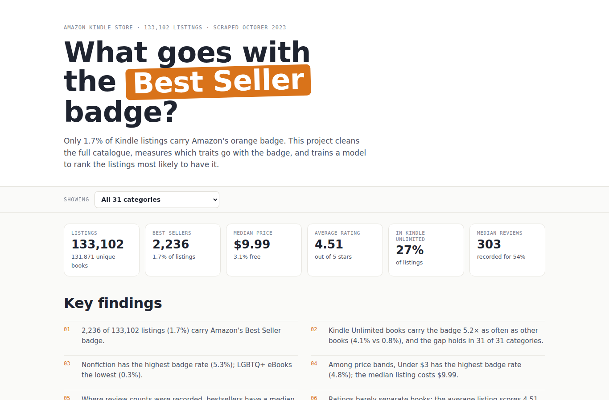

# Kindle Bestseller Analyzer

What goes with Amazon's **Best Seller** badge? A cleaning, analysis and modelling project on
**133,102 real Kindle listings** (131,871 unique books, 31 categories) scraped from Amazon in October 2023.

**Live dashboard:** https://akash-mondal10.github.io/Amazon-bestseller/



## Findings

1. 2,236 of 133,102 listings (1.7%) carry Amazon's Best Seller badge.
2. Kindle Unlimited books carry the badge 5.2× as often as other books (4.1% vs 0.8%), and the gap holds in 31 of 31 categories.
3. Nonfiction has the highest badge rate (5.3%); LGBTQ+ eBooks the lowest (0.3%).
4. Among price bands, Under $3 has the highest badge rate (4.8%); the median listing costs $9.99.
5. Where review counts were recorded, bestsellers have a median of 514 reviews vs 301 for other books.
6. Ratings barely separate books: the average listing scores 4.51 stars.
7. Review counts are missing for most books in 15 of 31 categories (a scraping gap), so review figures use recorded counts only.
8. The model's top 1% of listings are bestsellers 20.8% of the time, 12× the 1.7% base rate.

## Data cleaning

Real scraped data needed real fixes. Every rule is logged in `reports/cleaning_report.json`.

| Step | Rows | What and why |
|---|---:|---|
| Drop duplicate ASINs | 0 | Same Amazon listing scraped twice. |
| Fix category typo | 4,916 | 'Arts & Photo graphy' renamed to 'Arts & Photography'. |
| Fill missing authors | 425 | Kept the listing, author set to 'Unknown author'. |
| Unrated books | 3,182 | stars = 0 treated as 'no rating yet' (missing), not a score of 0. |
| Review counts not recorded | 61,488 | reviews = 0 on a rated book is impossible, so treated as missing. This affects whole categories where the scraper did not capture reviews. |
| Free books flagged | 4,066 | price = 0 kept as free listings, flagged is_free. |
| Missing publication date | 49,016 | Left missing; year-based charts use dated listings only. |
| Pre-orders flagged | 3 | Published after the October 2023 scrape. |
| Seller names grouped | 123,869 | 49 seller names grouped into 5 publisher groups. |
| One badge per listing | 0 | 9,259 listings show a badge and none show two, so Editors' Pick and Goodreads Choice listings never show Best Seller. Those flags are kept out of the model. |
| Repeat listings of the same book | 1,231 | Kept, because each listing has its own price, category and badge; used to keep a book's listings on one side of the train/test split. |

The biggest catch: **61,488 rated books showed 0 reviews**, which is impossible.
Review counts were simply not captured for most books in 15 of 31 categories, so those zeros are treated as missing
instead of being read as "nobody reviewed these books".

## Model

Only 1.7% of listings carry the badge, so accuracy is meaningless (always answering "no" scores 98.3%).
Models rank every listing and are scored on how many real bestsellers land at the top.

- 5-fold `StratifiedGroupKFold`, grouped by book, so editions of the same book never sit in both train and test.
- Editors' Pick and Goodreads Choice flags are excluded: a listing shows at most one badge, so they would leak the answer.

| Model | Precision in top 1% | Bestsellers found in top 5% | ROC-AUC | PR-AUC |
|---|---:|---:|---:|---:|
| Random ranking | 1.8% | 5.3% | 0.501 | 0.017 |
| Logistic regression | 15.9% | 27.6% | 0.816 | 0.083 |
| Gradient boosting | **20.8%** | **34.3%** | **0.839** | **0.113** |

Permutation importance (drop in PR-AUC on held-out books):

| Feature | Importance |
|---|---:|
| Kindle Unlimited | 0.0698 |
| Category | 0.0554 |
| Price | 0.0311 |
| Review count | 0.0301 |
| Publication year | 0.0117 |
| Publisher group | 0.0076 |
| Star rating | 0.0072 |

Ratings and reviews are measured at the same time as the badge, so this shows **association, not a sales forecast**.

## Project layout

```
analysis/kindle_analyzer/   load.py, clean.py, analyze.py, model.py, figures.py
analysis/run.py             runs the whole pipeline (~75 s)
reports/                    cleaning + model reports (JSON) and 9 Matplotlib/Seaborn charts
tests/                      pytest checks for cleaning rules and the leakage guard
web/                        React + Recharts dashboard (Vite), reads web/public/data
docs/                       built dashboard, served by GitHub Pages
```

## Run it

```bash
pip install -r requirements.txt
# put kindle_data-v2.csv in data/raw/ (see data/README.md)
python analysis/run.py          # cleaning, analysis, models, charts, dashboard data
python -m pytest -q             # tests
cd web && npm install && npm run build   # rebuilds docs/
```

## Data source

[Amazon Kindle Books Dataset 2023 (130K Books)](https://www.kaggle.com/datasets/asaniczka/amazon-kindle-books-dataset-2023-130k-books)
by asaniczka on Kaggle. Not affiliated with Amazon.
